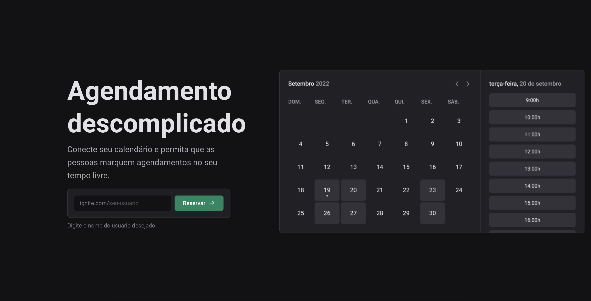
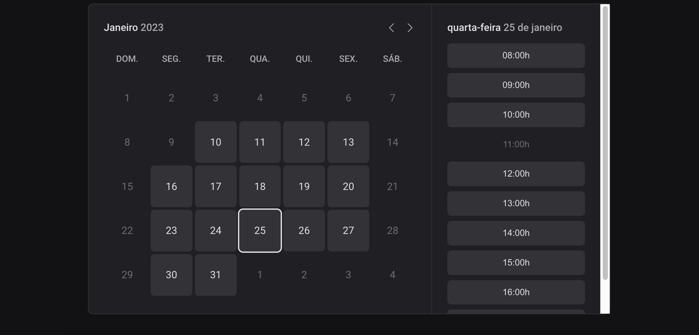

<h1 align="center">
  Ignite Call
</h1>

<p align="center">
  <a href="#-technology">Technology</a>&nbsp;&nbsp;&nbsp;|&nbsp;&nbsp;&nbsp;
  <a href="#-project">Project</a>&nbsp;&nbsp;&nbsp;|&nbsp;&nbsp;&nbsp;
  <a href="#-executing">Executing</a>&nbsp;&nbsp;&nbsp;
</p>

<br>

<p align="center">
  
</p>

<p align="center">
  
</p>

## 🚀 Technology

This project was developed with:

- React
- Next.js
- Typescript
- Node.js
- Prisma.io
- Google APIs
- Google Cloud Platform
- Docker
- Axios
- Next Seo
- React Hook Form
- Stitches
- Zod

## 🔖 Project

The Ignite Call project was built for scheduling appointments using a calendar integrated with Google Calendar. Users can sign up for the app using their Google account and specify the days of the week and times when they will be available to schedule appointments. All appointments will be saved in Google Calendar.


## 💻 Executing

This project was develop with [Next.js](https://nextjs.org/docs).

To run the application, a connection to a database (local or container) integrated with the Prisma.io tool is required, as well as creating a project on the Google Cloud Platform. This file also contains the connection URL that should be used for Prisma's connection to the database.

There is an .env.example file to assist with environment variables.

```sh
  # Clone this project
$ git clone git@github.com:italo-lima/ignite-call.git
# Install dependencies
$ yarn
# Run the project
$ yarn dev
# The server will initialize in the <http://localhost:3000>
```